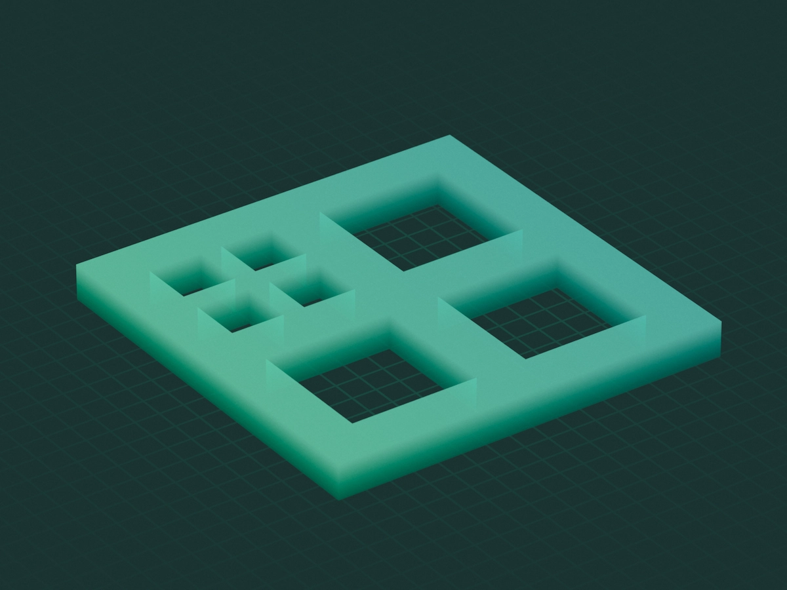

# What is GSX?

GSX is a C++20 library providing some of the basic stuff you'd need to build a game, simulation, or any other type of graphics project.

# `gsx::ecs`


GSX's data-driven ECS module lets you quickly write systems and create a world that manages those systems with minimal performance overhead. This is perfect for games or simulations where a lot of entities with different properties interact with each other in different ways.

```cpp
ecs::world_t world(
    "Garden",                                        // Name
    ecs::log_level_t::verbose,                       // Log level
    std::make_shared<ecs::csv_logger_t>("./log.csv") // Logger
);

world.add_system(
    std::make_shared<s_plants>(
        "Plant System",             // Name
        ecs::execution_scheme_t(0), // Execution scheme
        plants                      // Reference to plants
    )
);

...

world.run();
```

## Systems

A system is an abstract class that defines what happens, when the parent world is running, at the start, on each iteration, at the end, and when triggered by an event.

## Events

When the world is running, one system might broadcast an arbitrary event, which will then trigger only the systems that can be triggered by that event.

## Worlds

A world holds a list of systems, and provides a `run()` function that starts a loop and invokes the abstract functions of the systems in the right order.

## Parallelization

Worlds support system parallelization with custom ordering. Consider the following example of how one might want their systems to be updated:

1. Run System A and wait for it to finish.

2. Run System B and System C in parallel, and wait for them both to finish.

3. Run System D.

Configuring a world that runs its systems in the above order is as simple as setting the systems' update orders in increasing order, while systems with identical update orders will be updated in parallel. So, for example, System A could be at order #1, Systems B and C both at #5 (so that they are updated in parallel), and System D at #8. Note that the numbers are arbitrary, it's only the order that matters.

## Loggers

The ECS module lets you write your own custom logger for a world, while also providing built-in loggers by default, including a CSV logger and a `std::ostream` logger, which can be used to output to the console (`std::cout`) or a file.

# `gsx::math`


GSX provides a GLSL-like math and linear algebra module that's essential for many graphical applications and simulations. Here's what the math module provides:

- Vectors
- Quaternions
- Axis-Aligned Bounding Boxes (AABBs)
- Circular and Spherical Bounding Shapes
- Matrices
- Transformations
- Generic Math Functions
- Random Number Generators
- ...

```cpp
using namespace gsx::math;

vec2 pos(0);
vec2 vel(.5, -.2);

f32 speed = length(vel);

mat2 m = transform::rotate_2d(radians(30.));
pos = transform::apply_point_2d(m, pos);

bounds2 aabb(
    vec2(-1), // Minimum position
    vec2(1)   // Maximum position
);

if (inside(pos, aabb))
{
    ...
}

circle_t circle(
    vec2(.7, .1), // Center
    2             // Radius
);

if (overlaps(circle, aabb))
{
    ...
}

prng_t prng;
i32 num1 = prng.next_i32(1, 10);
f32 num2 = prng.next_f32(); // [0, 1]
```

# `gsx::spatial`



You might often need to store a list of particles or objects with spatial position attributes, and later need to find the neighbors of an object that are a certain distance away from it (or closer), or inside a specific bounding box. A naive implementation of this usually results in a time complexity of O(N^2) which is far from ideal. GSX provides data structures in the spatial module specifically designed to solve this problem by optimizing the way they store and query your objects.

```cpp
spatial::grid_2d_t<bird_t> birds(
    math::bounds2(min_pos, max_pos), // Grid bounds
    math::ivec2(8, 8)                // Grid resolution
);

for (usize i = 0; i < 1000; i++)
{
    bird_t bird;
    ...
    birds.insert(bird);
}

std::vector<bird_t*> birds_inside_circle;
birds.query(
    circle_t(...),
    birds_inside_circle
);

// Do something with the birds
...

birds.rebuild();
```

If your system stores a reference to a spatial data structure, you can use the generic `base_structure_2d_t` and `base_structure_3d_t` types that accept all spatial data structure types. One sub-class of `base_structure_Xd_t` is `linear_Xd_t` which uses a `std::vector` under the hood and has no spatial optimizations. Other sub-classes include:

- `grid_2d_t`
- `grid_3d_t`
- `hash_grid_2d_t`
- `hash_grid_3d_t`
- `quadtree_t`
- `octree_t`

# `gsx::common`

This module contains type aliases and useful macros.

```cpp
using i8 = int8_t;
using u8 = uint8_t;
using i16 = int16_t;
using u16 = uint16_t;
using i32 = int32_t;
using u32 = uint32_t;
using i64 = int64_t;
using u64 = uint64_t;
using isize = ptrdiff_t;
using usize = size_t;
using f32 = float;
using f64 = double;
```

The `gsx::common` namespace will be used by default, so you don't need a prefix to use the type aliases.

# More

Namespace `gsx::str` provides basic utility functions for strings. `gsx::misc` provides other useful functions and classes.

# Namespaces

The `gsx` namespace will be used by default, because of the following line in `gsx.h`:
```cpp
using namespace gsx;
```
You shouldn't worry about name conflicts, as there are no classes or functions directly inside `gsx`, but rather more nested namespaces like the ones you saw above. For example, `gsx::math`, `gsx::ecs`, etc.

# Demos

...
